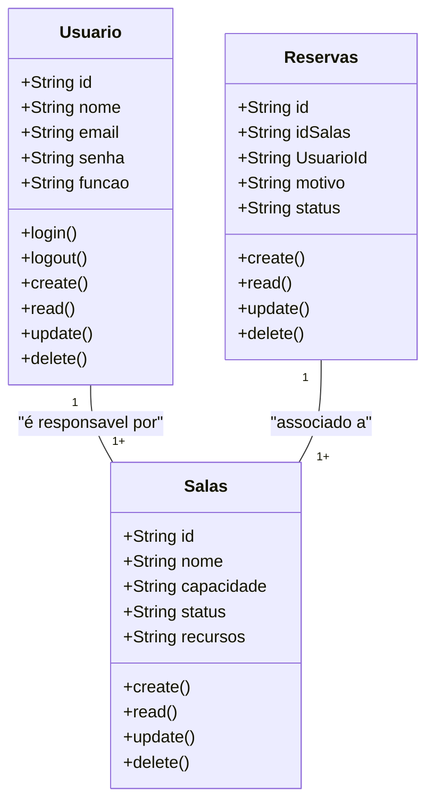

# Sitema De Sala De Reuniões (Somativa)

## Briefing

### Visão Geral do Projeto
O projeto contsiste no desenvolvimento de um sistema de Gestão da Sala de Reunião no formato de uma aplicação WEB.

## Escopo
- ### Objetivos:

- ## Pubico-Alvo:
    - Administrador.
    - Usuário Comum.

- ## Recursos Tecnológicos:

## Diagramas:

1. ### Diagramas de Classes
Este Diagrama modela as principais entidades do sistema:
- Usuários;
    - atributos: id, nome, eamil, senha, função.
    - métodos: create, read, update, delete, login, logout.
- Salas;
    - atributos: id, nome, capacidade, status, recuros.
    - métodos: create, read, update, delete.
- Reservas;
    - atributos: id, idSalas, UsuarioId, motivo, status.
    - métodos: create, read, update, delete.

## MongoDB.ts
- 1°: criar o endereço da conexão
- 2°: criar o cached, para armazenar as conexões ao longo do projeto
- 3°: verificar se já existe uma conexão estabelecida com DB
- 4°: criar uma promessa de conexão, caso ainda não exista
- 5°: transformar a promessa em uma conexão estabelecida

