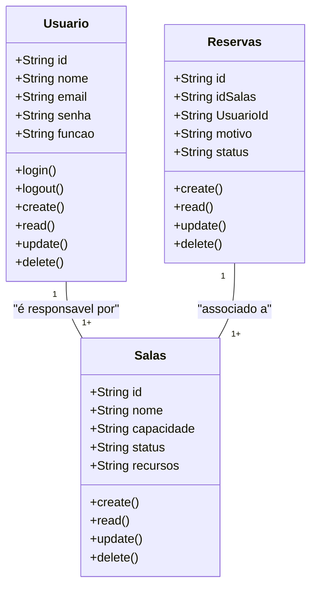
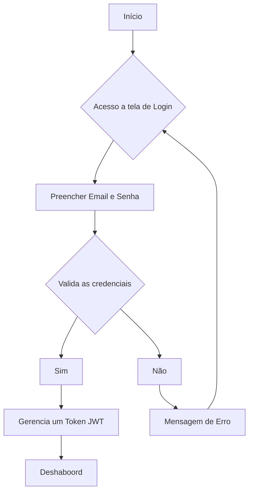

# Sitema De Connect Coworking (Somativa)

## Briefing

### Visão Geral do Projeto
O projeto contsiste no desenvolvimento de um sistema de Gestão da Sala de Reunião no formato de uma aplicação WEB.

## Escopo
- ### Objetivos:

- ## Pubico-Alvo:
    - Administrador.
    - Usuário Comum.

- ## Recursos Tecnológicos:

## Diagramas:

1. ### Diagramas de Classes
Este Diagrama modela as principais entidades do sistema:
- Usuários;
    - atributos: id, nome, eamil, senha, função.
    - métodos: create, read, update, delete, login, logout.
- Salas;
    - atributos: id, nome, capacidade, status, recuros.
    - métodos: create, read, update, delete.
- Reservas;
    - atributos: id, idSalas, UsuarioId, motivo, status.
    - métodos: create, read, update, delete.



### Explicação do Diagrama de Classe
- Um Usuário (Adimin) pode ser responsável por varias Reservas.
- Uma Sala pode estar associado a várias Reservas.

2. ### Diagrama de Caso de Uso 
Ilustrar as intenções do diferentes tipos de Usuarios com as funcionalidades do sistema.

### Explicação
- Usuários: Comum e Admin.

- Casos de Usos:
    - Admin: Gerenciar Salas e UsuáriosComuns (CRUD) e acessar o DashBord.
    - Comum:  Gereciar Reservas (CRUD) e acessar o DashBord.

    Fazer o Login -> antes de qualquer Ação.

```mermid
    graph TD
        subgraph "sala-reuniões"
            uc1([Fazer Login])
            uc2([Gerenciar Salas - CRUD])
            uc3([Gerenciar Reservas - CRUD])
            uc4([Gerenciar Usuários - CRUD])
            uc5([Acessar o Dashbord])
        end

        Adimin([Adiministrador do Sitema])
        Usuario([Usuario Comum])

        Adimin --> uc1
        Adimin --> uc2
        Adimin --> uc3
        Adimin --> uc5

        Usuario --> uc1
        Usuario --> uc2
        Usuario --> uc5
        
        uc2-,->uc1
        uc3-,->uc1
        uc4-,->uc1
        uc5-,->uc1

```

3. ### Diagrama de Fluxo(Login e Acesso ao Dashbord)
Detalhar o passo a passo que um usuário sege para se autenticar no sistema a acessae o dashbord.

### Explicação:
- O Fluxo começa quando osuário acessa a tela de login
- Insere as credenciais( email e senha)
- O sistema verifica se as credenciais são válidas
    - se sim: gera um JWT (token) => dashboard
    - se não: mensagem de erro eusuário permanece na tela de login



## Analise de Risco

# Matriz de Análise de Risco Do Projeto Connect Coworking
Está analise identifica os principais riscos que podem afetar a entrega do Mínimo Produto Viável (MVP) do Sistema de Reserva de Salas de Reunião, focando em segurança e funcionalidade.

1. ### Risco Crítico: Conflito de Agendamento
    - Descrição: O sistema permite, por falha na lógica do servidor, que duas reservas sejam criadas para a mesma sala e no mesmo intervalo de tempo.
    - Impacto: Crítico. Invalida o principal objetivo do sistema, causando os mesmos problemas que o cliente já tinha (reservas por e-mail).
    - Probabilidade: Alta. A lógica de tempo e datas (intervalos) é notoriamente complexa de implementar perfeitamente.

    ## Estratégia de Mitigação:
    - Implementar a lógica de checagem de conflito tanto no Front-end (para feedback imediato ao usuário) quanto no Back-end (validação final e autoritária).
    - No Model Mongoose, tentar garantir atomicidade e validação de não sobreposição antes da inserção.

2. ### Risco Elevado: Problemas de Autorização
    - Descrição: Falha no middleware de autorização, permitindo que um usuário com o papel (role) Comum acesse rotas ou funcionalidades exclusivas do Administrador (como o CRUD de Salas).
    - Impacto: Alto. Compromete a segurança e a integridade administrativa do sistema.
    - Probabilidade: Média. Requer atenção especial na adaptação das rotas de API do SGM base.

    ## Estratégia de Mitigação:
    - Reforçar o middleware de verificação de JWT e de role no servidor (Next.js API Routes), aplicando-o rigorosamente a todas as rotas POST, PUT, e DELETE relacionadas a /api/salas.

3. ### Risco Moderado: Complexidade de Horários
    - Descrição: Inconsistência na manipulação de fusos horários (Timezones) ou formatos de data/hora, resultando em reservas incorretas ou desalinhadas.
    - Impacto: Médio. Gera confusão para o usuário e pode levar a conflitos não detectados.
    -  Probabilidade: Média. Manipular datas em JavaScript e MongoDB exige cautela.

    ## Estratégia de Mitigação:
    - Padronização: Armazenar todas as datas e horários no MongoDB estritamente no formato UTC (ISO 8601).
    - A conversão para o fuso horário local do usuário deve ser feita apenas na exibição do Front-end para garantir que o backend use uma fonte única de verdade.

4. ### Risco Baixo: Consistência na Estilização
    - Descrição: Conflito ou inconsistência entre os estilos (SCSS) dos novos componentes de reserva e os estilos já existentes no projeto-base (SGM).
    - Impacto: Médio. Problemas estéticos e de usabilidade (UX).
    - Probabilidade: Baixa. O uso de CSS Modules mitiga este risco.

    ## Estratégia de Mitigação:
    - Utilizar CSS Modules (.module.scss) para os novos componentes (SalaTable, RoomCard, etc.) para encapsular os estilos e evitar vazamento ou conflito com estilos globais.


## Prototipagem:
- Link Figma: https://www.figma.com/proto/Vb3dL2cd1ENc9yhkCBAV9o/Sem-t%C3%ADtulo?node-id=0-1&t=L1LdylMsnmFmc3fD-1


## MongoDB.ts
- 1°: criar o endereço da conexão
- 2°: criar o cached, para armazenar as conexões ao longo do projeto
- 3°: verificar se já existe uma conexão estabelecida com DB
- 4°: criar uma promessa de conexão, caso ainda não exista
- 5°: transformar a promessa em uma conexão estabelecida


